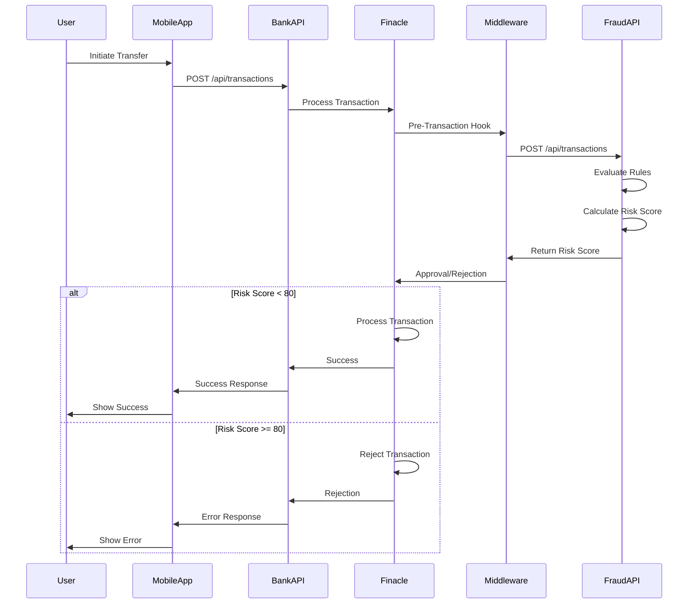
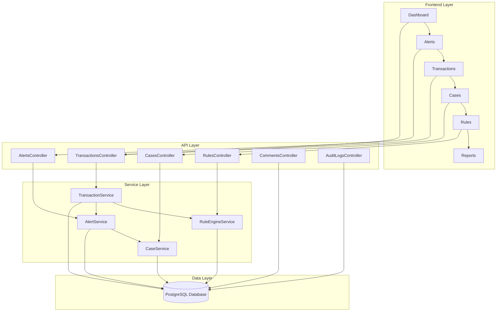
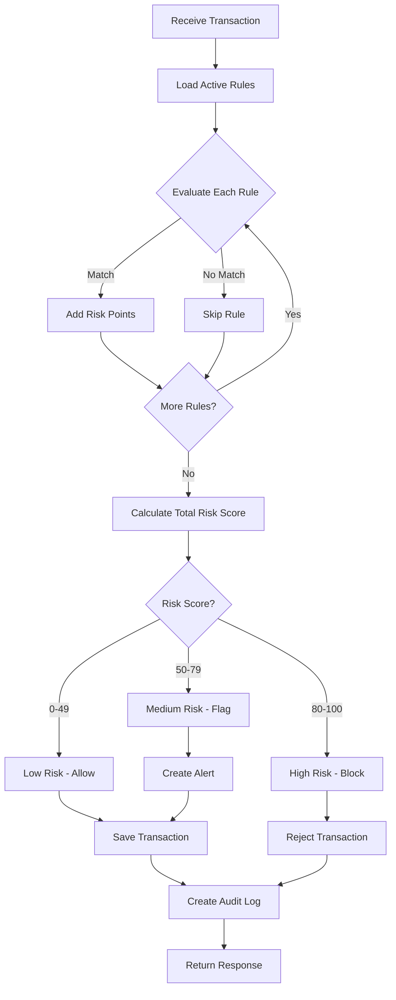

# Visual Diagrams - Integration & System Architecture

## Table of Contents
1. [Integration Flow Diagram](#integration-flow-diagram)
2. [Fraud Detection App Architecture](#fraud-detection-app-architecture)
3. [Transaction Processing Flow](#transaction-processing-flow)
4. [System Components Overview](#system-components-overview)

---

## Integration Flow Diagram

### ASCII Art Diagram

```
┌─────────────────────────────────────────────────────────────────────────────────────┐
│                              BANKING INTEGRATION FLOW                               │
└─────────────────────────────────────────────────────────────────────────────────────┘

    ┌──────────────┐
    │   CUSTOMER   │
    │   (User)     │
    └──────┬───────┘
           │
           │ 1. Initiates Transfer
           │    Amount: ₦500,000
           │    To: Account 9876543210
           ▼
    ┌─────────────────────────────────────────────────────────────────┐
    │                    MOBILE BANKING APP                           │
    │                  (iOS / Android)                                │
    │                                                                 │
    │  ┌──────────────────────────────────────────────────────────┐  │
    │  │  Transfer Screen                                         │  │
    │  │  - From Account Input                                    │  │
    │  │  - To Account Input                                      │  │
    │  │  - Amount Input                                          │  │
    │  │  - Submit Button                                         │  │
    │  └──────────────────────────────────────────────────────────┘  │
    │                                                                 │
    │  Collects:                                                      │
    │  • Device ID                                                    │
    │  • Device Model                                                 │
    │  • App Version                                                  │
    │  • Location (GPS)                                               │
    └──────┬──────────────────────────────────────────────────────────┘
           │
           │ 2. POST /api/transactions
           │    {
           │      "fromAccount": "1234567890",
           │      "toAccount": "9876543210",
           │      "amount": 500000,
           │      "type": "transfer"
           │    }
           │    Headers:
           │    - Authorization: Bearer {userToken}
           │    - X-Device-ID: {deviceId}
           │    - X-App-Version: 2.1.0
           ▼
    ┌─────────────────────────────────────────────────────────────────┐
    │                    BANK API GATEWAY                              │
    │                  (REST API Server)                               │
    │                                                                 │
    │  ┌──────────────────────────────────────────────────────────┐  │
    │  │  API Gateway Functions:                                  │  │
    │  │  ✓ Authentication & Authorization                        │  │
    │  │  ✓ Rate Limiting                                         │  │
    │  │  ✓ Request Validation                                    │  │
    │  │  ✓ IP Address Extraction                                 │  │
    │  │  ✓ Location Enrichment                                   │  │
    │  │  ✓ Request Logging                                       │  │
    │  └──────────────────────────────────────────────────────────┘  │
    │                                                                 │
    │  Adds Metadata:                                                 │
    │  • IP Address: 192.168.1.100                                   │
    │  • Timestamp: 2024-01-15T10:30:00Z                             │
    │  • User ID: {fromToken}                                        │
    │  • Session ID: {sessionId}                                     │
    └──────┬──────────────────────────────────────────────────────────┘
           │
           │ 3. Internal API Call
           │    (SOAP/REST to Finacle)
           ▼
    ┌─────────────────────────────────────────────────────────────────┐
    │              FINACLE CORE BANKING SYSTEM                        │
    │                  (Core Banking Platform)                        │
    │                                                                 │
    │  ┌──────────────────────────────────────────────────────────┐  │
    │  │  Transaction Processing:                                 │  │
    │  │  ✓ Account Validation                                    │  │
    │  │  ✓ Balance Check                                         │  │
    │  │  ✓ Account Status Check                                  │  │
    │  │  ✓ Transaction Limits Check                              │  │
    │  │  ✓ Pre-Transaction Hook Trigger                          │  │
    │  └──────────────────────────────────────────────────────────┘  │
    │                                                                 │
    │  Transaction Data:                                              │
    │  • Debit Account: 1234567890                                   │
    │  • Credit Account: 9876543210                                  │
    │  • Amount: ₦500,000                                            │
    │  • Transaction Code: FT (Fund Transfer)                        │
    │  • Branch Code: 001                                            │
    │  • Channel: MOBILE                                             │
    └──────┬──────────────────────────────────────────────────────────┘
           │
           │ 4. Pre-Transaction Hook
           │    (Before committing transaction)
           ▼
    ┌─────────────────────────────────────────────────────────────────┐
    │            INTEGRATION MIDDLEWARE                               │
    │         (Fraud Detection Client Service)                        │
    │                                                                 │
    │  ┌──────────────────────────────────────────────────────────┐  │
    │  │  Middleware Functions:                                   │  │
    │  │  ✓ Data Transformation                                   │  │
    │  │  ✓ API Authentication                                    │  │
    │  │  ✓ Request Formatting                                    │  │
    │  │  ✓ Response Processing                                   │  │
    │  │  ✓ Error Handling                                        │  │
    │  │  ✓ Retry Logic                                           │  │
    │  └──────────────────────────────────────────────────────────┘  │
    │                                                                 │
    │  Transforms to API Format:                                      │
    │  {                                                              │
    │    "senderAccountNumber": "1234567890",                        │
    │    "receiverAccountNumber": "9876543210",                      │
    │    "transactionType": "Transfer",                              │
    │    "amount": 500000,                                           │
    │    "location": "NG-LAGOS",                                     │
    │    "device": "iOS",                                            │
    │    "ipAddress": "192.168.1.100"                                │
    │  }                                                              │
    └──────┬──────────────────────────────────────────────────────────┘
           │
           │ 5. HTTPS POST /api/transactions
           │    Authorization: Bearer {apiToken}
           │    (External API Call)
           ▼
    ┌─────────────────────────────────────────────────────────────────┐
    │              FRAUD DETECTION API                                │
    │              (External Service)                                 │
    │                                                                 │
    │  ┌──────────────────────────────────────────────────────────┐  │
    │  │  Transaction Analysis:                                   │  │
    │  │                                                          │  │
    │  │  1. Rule Engine Evaluation                              │  │
    │  │     ✓ Amount Rules (₦500,000 > threshold?)              │  │
    │  │     ✓ Device Rules (New device detected?)               │  │
    │  │     ✓ Location Rules (Unusual location?)                │  │
    │  │     ✓ Time Rules (Outside business hours?)              │  │
    │  │     ✓ Velocity Rules (Too many transactions?)           │  │
    │  │                                                          │  │
    │  │  2. Risk Score Calculation                              │  │
    │  │     Base Score: 0                                        │  │
    │  │     + Amount Risk: +20                                   │  │
    │  │     + Device Risk: +15                                   │  │
    │  │     + Location Risk: +10                                 │  │
    │  │     + Time Risk: +5                                      │  │
    │  │     ─────────────────                                    │  │
    │  │     Total Risk Score: 50                                 │  │
    │  │                                                          │  │
    │  │  3. Decision Making                                     │  │
    │  │     Risk Level: Medium (50-79)                          │  │
    │  │     Action: FLAG (Allow but monitor)                    │  │
    │  └──────────────────────────────────────────────────────────┘  │
    │                                                                 │
    │  Response:                                                      │
    │  {                                                              │
    │    "id": "abc-123-def-456",                                    │
    │    "riskScore": 50,                                            │
    │    "isFlagged": true,                                          │
    │    "status": "Completed"                                       │
    │  }                                                              │
    └──────┬──────────────────────────────────────────────────────────┘
           │
           │ 6. Response with Risk Score
           │
           ▼
    ┌─────────────────────────────────────────────────────────────────┐
    │            INTEGRATION MIDDLEWARE                               │
    │                                                                 │
    │  Decision Logic:                                                │
    │  • Risk Score: 50                                               │
    │  • Threshold: Medium = 50                                       │
    │  • Action: APPROVE with FLAG                                    │
    │  • Log for review team                                          │
    └──────┬──────────────────────────────────────────────────────────┘
           │
           │ 7. Approval Response
           │    { approved: true, flagged: true }
           │
           ▼
    ┌─────────────────────────────────────────────────────────────────┐
    │              FINACLE CORE BANKING SYSTEM                        │
    │                                                                 │
    │  Processes Transaction:                                         │
    │  ✓ Debits sender account: -₦500,000                            │
    │  ✓ Credits receiver account: +₦500,000                         │
    │  ✓ Updates account balances                                    │
    │  ✓ Creates transaction record                                  │
    │  ✓ Sets review flag                                            │
    │  ✓ Generates transaction ID                                    │
    └──────┬──────────────────────────────────────────────────────────┘
           │
           │ 8. Transaction Result
           │    { status: "success", transactionId: "TXN123456" }
           │
           ▼
    ┌─────────────────────────────────────────────────────────────────┐
    │                    BANK API GATEWAY                              │
    │                                                                 │
    │  Formats Response:                                              │
    │  {                                                              │
    │    "transactionId": "TXN123456",                                │
    │    "status": "success",                                         │
    │    "message": "Transaction completed successfully"              │
    │  }                                                              │
    └──────┬──────────────────────────────────────────────────────────┘
           │
           │ 9. HTTP 200 OK Response
           │
           ▼
    ┌─────────────────────────────────────────────────────────────────┐
    │                    MOBILE BANKING APP                           │
    │                                                                 │
    │  Displays Success:                                              │
    │  ┌────────────────────────────────────────────┐                │
    │  │  ✓ Transaction Successful                  │                │
    │  │                                            │                │
    │  │  ₦500,000 transferred to                   │                │
    │  │  Account: 9876543210                       │                │
    │  │                                            │                │
    │  │  Transaction ID: TXN123456                 │                │
    │  │  Date: Jan 15, 2024 10:30 AM              │                │
    │  │                                            │                │
    │  │  [View Receipt]  [Done]                    │                │
    │  └────────────────────────────────────────────┘                │
    └─────────────────────────────────────────────────────────────────┘
           │
           ▼
    ┌──────────────┐
    │   CUSTOMER   │
    │  Sees Success│
    └──────────────┘
```

---

## Fraud Detection App Architecture

### ASCII Art Diagram

```
┌─────────────────────────────────────────────────────────────────────────────────────┐
│                    FRAUD DETECTION SYSTEM ARCHITECTURE                              │
└─────────────────────────────────────────────────────────────────────────────────────┘

┌─────────────────────────────────────────────────────────────────────────────────────┐
│                                  FRONTEND LAYER                                     │
│                              (React.js Web Application)                             │
├─────────────────────────────────────────────────────────────────────────────────────┤
│                                                                                     │
│  ┌──────────────┐  ┌──────────────┐  ┌──────────────┐  ┌──────────────┐          │
│  │   Dashboard  │  │  Alerts      │  │ Transactions │  │  Cases       │          │
│  │              │  │              │  │              │  │              │          │
│  │ • Overview   │  │ • Pending    │  │ • List       │  │ • New        │          │
│  │ • Metrics    │  │ • Reviewing  │  │ • Details    │  │ • Investigating│        │
│  │ • Charts     │  │ • Resolved   │  │ • Filter     │  │ • Resolved   │          │
│  └──────────────┘  └──────────────┘  └──────────────┘  └──────────────┘          │
│                                                                                     │
│  ┌──────────────┐  ┌──────────────┐  ┌──────────────┐  ┌──────────────┐          │
│  │ Rules Engine │  │ Custom       │  │ Behavioral   │  │ Audit Logs   │          │
│  │              │  │ Reports      │  │ Analytics    │  │              │          │
│  │ • Create     │  │ • Generate   │  │ • Patterns   │  │ • View       │          │
│  │ • Edit       │  │ • Export     │  │ • Trends     │  │ • Filter     │          │
│  │ • Toggle     │  │ • Schedule   │  │ • Insights   │  │ • Search     │          │
│  └──────────────┘  └──────────────┘  └──────────────┘  └──────────────┘          │
│                                                                                     │
│  Technologies:                                                                      │
│  • React.js + TypeScript                                                           │
│  • TanStack Query (Data Fetching)                                                  │
│  • Shadcn/ui (UI Components)                                                       │
│  • React Router (Navigation)                                                       │
│  • Axios (HTTP Client)                                                             │
│                                                                                     │
└─────────────────────────────────────────────────────────────────────────────────────┘
                                    │
                                    │ HTTPS/REST API
                                    │
┌───────────────────────────────────┴─────────────────────────────────────────────────┐
│                                  API LAYER                                          │
│                          (ASP.NET Core Web API)                                     │
├─────────────────────────────────────────────────────────────────────────────────────┤
│                                                                                     │
│  ┌──────────────────────────────────────────────────────────────────────────────┐  │
│  │                            API CONTROLLERS                                   │  │
│  ├──────────────────────────────────────────────────────────────────────────────┤  │
│  │                                                                              │  │
│  │  ┌──────────────┐  ┌──────────────┐  ┌──────────────┐  ┌──────────────┐   │  │
│  │  │Transactions  │  │   Alerts     │  │    Cases     │  │    Rules     │   │  │
│  │  │Controller    │  │  Controller  │  │  Controller  │  │  Controller  │   │  │
│  │  │              │  │              │  │              │  │              │   │  │
│  │  │• GET /list   │  │• GET /list   │  │• GET /list   │  │• GET /list   │   │  │
│  │  │• GET /{id}   │  │• GET /{id}   │  │• GET /{id}   │  │• GET /{id}   │   │  │
│  │  │• POST /      │  │• PUT /status │  │• POST /      │  │• POST /      │   │  │
│  │  │• PUT /flag   │  │              │  │• PUT /{id}   │  │• PUT /{id}   │   │  │
│  │  └──────────────┘  └──────────────┘  │• PUT /status │  │• DELETE /{id}│   │  │
│  │                                       │• DELETE /{id}│  │• PUT /toggle │   │  │
│  │  ┌──────────────┐  ┌──────────────┐  └──────────────┘  └──────────────┘   │  │
│  │  │  Comments    │  │ Audit Logs   │  ┌──────────────┐  ┌──────────────┐   │  │
│  │  │  Controller  │  │  Controller  │  │    Auth      │  │  Dashboard   │   │  │
│  │  │              │  │              │  │  Controller  │  │  Controller  │   │  │
│  │  │• GET /txn/{id}│ │• GET /list   │  │              │  │              │   │  │
│  │  │• GET /case/{id}││• GET /entity │  │• POST /login │  │• GET /stats  │   │  │
│  │  │• POST /txn/{id}││              │  │              │  │• GET /metrics│   │  │
│  │  │• POST /case/{id}│              │  │              │  │              │   │  │
│  │  │• DELETE /{id} │  │              │  │              │  │              │   │  │
│  │  └──────────────┘  └──────────────┘  └──────────────┘  └──────────────┘   │  │
│  │                                                                              │  │
│  └──────────────────────────────────────────────────────────────────────────────┘  │
│                                                                                     │
│  ┌──────────────────────────────────────────────────────────────────────────────┐  │
│  │                          AUTHENTICATION & AUTHORIZATION                      │  │
│  ├──────────────────────────────────────────────────────────────────────────────┤  │
│  │                                                                              │  │
│  │  • JWT Token Authentication                                                  │  │
│  │  • Role-Based Access Control (Admin, Analyst)                                │  │
│  │  • API Key Authentication (for external integrations)                        │  │
│  │  • Token Refresh Mechanism                                                   │  │
│  │                                                                              │  │
│  └──────────────────────────────────────────────────────────────────────────────┘  │
│                                                                                     │
│  ┌──────────────────────────────────────────────────────────────────────────────┐  │
│  │                              MIDDLEWARE                                      │  │
│  ├──────────────────────────────────────────────────────────────────────────────┤  │
│  │                                                                              │  │
│  │  • Request Logging                                                           │  │
│  │  • Error Handling                                                            │  │
│  │  • CORS Configuration                                                        │  │
│  │  • Rate Limiting                                                             │  │
│  │  • Audit Log Creation                                                        │  │
│  │                                                                              │  │
│  └──────────────────────────────────────────────────────────────────────────────┘  │
│                                                                                     │
└─────────────────────────────────────────────────────────────────────────────────────┘
                                    │
                                    │ Entity Framework Core
                                    │
┌───────────────────────────────────┴─────────────────────────────────────────────────┐
│                              APPLICATION LAYER                                      │
│                          (Business Logic & Services)                                │
├─────────────────────────────────────────────────────────────────────────────────────┤
│                                                                                     │
│  ┌──────────────────────────────────────────────────────────────────────────────┐  │
│  │                              SERVICES                                        │  │
│  ├──────────────────────────────────────────────────────────────────────────────┤  │
│  │                                                                              │  │
│  │  ┌──────────────────────────────────────────────────────────────────────┐   │  │
│  │  │              Transaction Service                                     │   │  │
│  │  │  • Create Transaction                                                │   │  │
│  │  │  • Get Transaction Details                                           │   │  │
│  │  │  • Flag/Unflag Transaction                                           │   │  │
│  │  │  • Get Transaction List (with pagination)                            │   │  │
│  │  └──────────────────────────────────────────────────────────────────────┘   │  │
│  │                                                                              │  │
│  │  ┌──────────────────────────────────────────────────────────────────────┐   │  │
│  │  │                  Rule Engine Service                                 │   │  │
│  │  │  • Evaluate Rules Against Transaction                                │   │  │
│  │  │  • Calculate Risk Score (0-100)                                      │   │  │
│  │  │  • Determine Risk Level (Low/Medium/High)                            │   │  │
│  │  │  • Trigger Alerts                                                    │   │  │
│  │  │                                                                       │   │  │
│  │  │  Rule Types:                                                         │   │  │
│  │  │  • Amount Rules (Greater Than, Less Than)                            │   │  │
│  │  │  • Device Rules (New Device Detection)                               │   │  │
│  │  │  • Location Rules (Unusual Location)                                 │   │  │
│  │  │  • Transaction Type Rules                                            │   │  │
│  │  │  • Velocity Rules (Transaction Frequency)                            │   │  │
│  │  └──────────────────────────────────────────────────────────────────────┘   │  │
│  │                                                                              │  │
│  │  ┌──────────────────────────────────────────────────────────────────────┐   │  │
│  │  │                  Alert Service                                       │   │  │
│  │  │  • Create Alert from Flagged Transaction                             │   │  │
│  │  │  • Update Alert Status                                               │   │  │
│  │  │  • Assign Alert to Analyst                                           │   │  │
│  │  │  • Get Alert List (with filters)                                     │   │  │
│  │  └──────────────────────────────────────────────────────────────────────┘   │  │
│  │                                                                              │  │
│  │  ┌──────────────────────────────────────────────────────────────────────┐   │  │
│  │  │                  Case Service                                        │   │  │
│  │  │  • Create Case from Alert                                            │   │  │
│  │  │  • Update Case Status                                                │   │  │
│  │  │  • Assign Investigator                                               │   │  │
│  │  │  • Get Case Details                                                  │   │  │
│  │  └──────────────────────────────────────────────────────────────────────┘   │  │
│  │                                                                              │  │
│  └──────────────────────────────────────────────────────────────────────────────┘  │
│                                                                                     │
└─────────────────────────────────────────────────────────────────────────────────────┘
                                    │
                                    │ Entity Framework Core
                                    │
┌───────────────────────────────────┴─────────────────────────────────────────────────┐
│                              DATA ACCESS LAYER                                      │
│                          (Entity Framework Core ORM)                                │
├─────────────────────────────────────────────────────────────────────────────────────┤
│                                                                                     │
│  ┌──────────────────────────────────────────────────────────────────────────────┐  │
│  │                            DB CONTEXT                                        │  │
│  │                        (AppDbContext)                                        │  │
│  ├──────────────────────────────────────────────────────────────────────────────┤  │
│  │                                                                              │  │
│  │  DbSet<Transaction>     → Transactions Table                                │  │
│  │  DbSet<Alert>           → Alerts Table                                      │  │
│  │  DbSet<Case>            → Cases Table                                       │  │
│  │  DbSet<Rule>            → Rules Table                                       │  │
│  │  DbSet<Comment>         → Comments Table                                    │  │
│  │  DbSet<AuditLog>        → AuditLogs Table                                   │  │
│  │  DbSet<User>            → Users Table (Identity)                            │  │
│  │  DbSet<Notification>    → Notifications Table                               │  │
│  │                                                                              │  │
│  └──────────────────────────────────────────────────────────────────────────────┘  │
│                                                                                     │
└─────────────────────────────────────────────────────────────────────────────────────┘
                                    │
                                    │ PostgreSQL Connection
                                    │
┌───────────────────────────────────┴─────────────────────────────────────────────────┐
│                              DATABASE LAYER                                         │
│                            (PostgreSQL Database)                                    │
├─────────────────────────────────────────────────────────────────────────────────────┤
│                                                                                     │
│  ┌──────────────┐  ┌──────────────┐  ┌──────────────┐  ┌──────────────┐          │
│  │Transactions  │  │   Alerts     │  │    Cases     │  │    Rules     │          │
│  │              │  │              │  │              │  │              │          │
│  │• id          │  │• id          │  │• id          │  │• id          │          │
│  │• sender      │  │• transactionId│ │• title       │  │• name        │          │
│  │• receiver    │  │• severity    │  │• description │  │• field       │          │
│  │• amount      │  │• status      │  │• status      │  │• condition   │          │
│  │• type        │  │• createdAt   │  │• transactionId│ │• value       │          │
│  │• riskScore   │  │              │  │• investigatorId││• isEnabled   │          │
│  │• isFlagged   │  │              │  │• createdAt   │  │• createdAt   │          │
│  │• location    │  │              │  │              │  │              │          │
│  │• device      │  │              │  │              │  │              │          │
│  │• createdAt   │  │              │  │              │  │              │          │
│  └──────────────┘  └──────────────┘  └──────────────┘  └──────────────┘          │
│                                                                                     │
│  ┌──────────────┐  ┌──────────────┐  ┌──────────────┐  ┌──────────────┐          │
│  │  Comments    │  │ Audit Logs   │  │   Users      │  │Notifications │          │
│  │              │  │              │  │              │  │              │          │
│  │• id          │  │• id          │  │• id          │  │• id          │          │
│  │• content     │  │• action      │  │• email       │  │• text        │          │
│  │• transactionId│ │• entityType  │  │• fullName    │  │• isSent      │          │
│  │• caseId      │  │• entityId    │  │• role        │  │• markedAsRead│          │
│  │• createdBy   │  │• userId      │  │• passwordHash│  │• createdAt   │          │
│  │• isInternal  │  │• userName    │  │              │  │              │          │
│  │• createdAt   │  │• details     │  │              │  │              │          │
│  │              │  │• createdAt   │  │              │  │              │          │
│  └──────────────┘  └──────────────┘  └──────────────┘  └──────────────┘          │
│                                                                                     │
│  Relationships:                                                                     │
│  • Transaction → Alerts (One-to-Many)                                              │
│  • Transaction → Comments (One-to-Many)                                            │
│  • Case → Transaction (Many-to-One)                                                │
│  • Case → Comments (One-to-Many)                                                   │
│  • Alert → Case (Many-to-One)                                                      │
│                                                                                     │
└─────────────────────────────────────────────────────────────────────────────────────┘
```

---

## Transaction Processing Flow

### Detailed Processing Steps

```
┌─────────────────────────────────────────────────────────────────────────────────────┐
│                        TRANSACTION PROCESSING FLOW                                  │
└─────────────────────────────────────────────────────────────────────────────────────┘

    [External System]
    (Bank API / Finacle)
           │
           │ 1. POST /api/transactions
           │    {
           │      "senderAccountNumber": "1234567890",
           │      "receiverAccountNumber": "9876543210",
           │      "transactionType": "Transfer",
           │      "amount": 500000,
           │      "location": "NG-LAGOS",
           │      "device": "iOS",
           │      "ipAddress": "192.168.1.100"
           │    }
           ▼
    ┌─────────────────────────────────────────────────────────────────┐
    │                    TransactionsController                        │
    │                    [POST /api/transactions]                      │
    │                                                                 │
    │  • Validates request                                            │
    │  • Authenticates API key/token                                  │
    │  • Creates Transaction entity                                   │
    └────────────────────┬────────────────────────────────────────────┘
                         │
                         │ 2. Create Transaction
                         ▼
    ┌─────────────────────────────────────────────────────────────────┐
    │                    TransactionService                            │
    │                    [CreateAsync()]                               │
    │                                                                 │
    │  ┌──────────────────────────────────────────────────────────┐  │
    │  │  Step 1: Load Active Rules                               │  │
    │  │  • Query Rules table                                     │  │
    │  │  • Filter: isEnabled = true                              │  │
    │  └──────────────────────────────────────────────────────────┘  │
    │                                                                 │
    │  ┌──────────────────────────────────────────────────────────┐  │
    │  │  Step 2: Rule Engine Evaluation                          │  │
    │  │                                                          │  │
    │  │  For each active rule:                                   │  │
    │  │  ┌──────────────────────────────────────────────────┐   │  │
    │  │  │ Rule: "High Value Transaction"                   │   │  │
    │  │  │ Field: Amount                                     │   │  │
    │  │  │ Condition: GreaterThan                            │   │  │
    │  │  │ Value: 100000                                     │   │  │
    │  │  │                                                   │   │  │
    │  │  │ Evaluation:                                       │   │  │
    │  │  │ Transaction Amount (500000) > Rule Value (100000) │   │  │
    │  │  │ Result: MATCH ✓                                   │   │  │
    │  │  │ Risk Points: +20                                  │   │  │
    │  │  └──────────────────────────────────────────────────┘   │  │
    │  │                                                          │  │
    │  │  ┌──────────────────────────────────────────────────┐   │  │
    │  │  │ Rule: "New Device Detection"                     │   │  │
    │  │  │ Field: Device                                    │   │  │
    │  │  │ Condition: Equals                                │   │  │
    │  │  │ Value: NewDevice                                 │   │  │
    │  │  │                                                   │   │  │
    │  │  │ Evaluation:                                       │   │  │
    │  │  │ Transaction Device ("iOS") ≠ Rule Value ("NewDevice")│ │
    │  │  │ Result: NO MATCH ✗                                │   │  │
    │  │  │ Risk Points: +0                                   │   │  │
    │  │  └──────────────────────────────────────────────────┘   │  │
    │  │                                                          │  │
    │  │  ┌──────────────────────────────────────────────────┐   │  │
    │  │  │ Rule: "Unusual Location"                         │   │  │
    │  │  │ Field: Location                                  │   │  │
    │  │  │ Condition: NotEquals                             │   │  │
    │  │  │ Value: NG-LAGOS                                  │   │  │
    │  │  │                                                   │   │  │
    │  │  │ Evaluation:                                       │   │  │
    │  │  │ Transaction Location ("NG-LAGOS") = Rule Value    │   │  │
    │  │  │ Result: NO MATCH ✗                                │   │  │
    │  │  │ Risk Points: +0                                   │   │  │
    │  │  └──────────────────────────────────────────────────┘   │  │
    │  └──────────────────────────────────────────────────────────┘  │
    │                                                                 │
    │  ┌──────────────────────────────────────────────────────────┐  │
    │  │  Step 3: Calculate Risk Score                            │  │
    │  │                                                          │  │
    │  │  Base Score: 0                                           │  │
    │  │  + Amount Risk: +20                                      │  │
    │  │  + Device Risk: +0                                       │  │
    │  │  + Location Risk: +0                                     │  │
    │  │  + Time-based Risk: +5 (if outside hours)                │  │
    │  │  ─────────────────                                       │  │
    │  │  Total Risk Score: 25                                    │  │
    │  │                                                          │  │
    │  │  Risk Level: LOW (0-49)                                  │  │
    │  └──────────────────────────────────────────────────────────┘  │
    │                                                                 │
    │  ┌──────────────────────────────────────────────────────────┐  │
    │  │  Step 4: Determine Action                                │  │
    │  │                                                          │  │
    │  │  Risk Score: 25                                          │  │
    │  │  Risk Level: LOW                                         │  │
    │  │  Action: ALLOW                                           │  │
    │  │  isFlagged: false                                        │  │
    │  └──────────────────────────────────────────────────────────┘  │
    │                                                                 │
    │  ┌──────────────────────────────────────────────────────────┐  │
    │  │  Step 5: Save Transaction                                │  │
    │  │  • Set riskScore = 25                                    │  │
    │  │  • Set isFlagged = false                                 │  │
    │  │  • Save to database                                      │  │
    │  └──────────────────────────────────────────────────────────┘  │
    │                                                                 │
    │  ┌──────────────────────────────────────────────────────────┐  │
    │  │  Step 6: Create Alert (if flagged)                       │  │
    │  │  • Only if isFlagged = true                              │  │
    │  │  • Create Alert record                                   │  │
    │  │  • Set severity based on risk score                      │  │
    │  │  • Set status = Pending                                  │  │
    │  └──────────────────────────────────────────────────────────┘  │
    │                                                                 │
    │  ┌──────────────────────────────────────────────────────────┐  │
    │  │  Step 7: Create Audit Log                                │  │
    │  │  • Action: "Transaction Created"                         │  │
    │  │  • Entity Type: "Transaction"                            │  │
    │  │  • Entity ID: {transactionId}                            │  │
    │  │  • User: API Service Account                             │  │
    │  │  • Details: "Amount: 500000, Risk: 25"                   │  │
    │  └──────────────────────────────────────────────────────────┘  │
    │                                                                 │
    └────────────────────┬────────────────────────────────────────────┘
                         │
                         │ 3. Return Response
                         ▼
    ┌─────────────────────────────────────────────────────────────────┐
    │                    Response to External System                   │
    │                                                                 │
    │  {                                                              │
    │    "id": "abc-123-def-456",                                    │
    │    "senderAccountNumber": "1234567890",                        │
    │    "receiverAccountNumber": "9876543210",                      │
    │    "transactionType": "Transfer",                              │
    │    "amount": 500000,                                           │
    │    "riskScore": 25,                                            │
    │    "isFlagged": false,                                         │
    │    "status": "Completed",                                      │
    │    "createdAt": "2024-01-15T10:30:00Z"                        │
    │  }                                                              │
    └─────────────────────────────────────────────────────────────────┘
```

---

## System Components Overview

### Component Interaction Diagram

```
┌─────────────────────────────────────────────────────────────────────────────────────┐
│                          SYSTEM COMPONENTS INTERACTION                              │
└─────────────────────────────────────────────────────────────────────────────────────┘

    ┌─────────────────────────────────────────────────────────────────┐
    │                         USER INTERFACE                          │
    │                    (React.js Frontend)                          │
    │                                                                 │
    │  • Dashboard (View metrics, charts)                            │
    │  • Alerts (Review flagged transactions)                        │
    │  • Transactions (Browse transaction history)                   │
    │  • Cases (Manage fraud cases)                                  │
    │  • Rules (Configure detection rules)                           │
    │  • Reports (Generate custom reports)                           │
    │  • Analytics (Behavioral analysis)                             │
    └────────────────────┬────────────────────────────────────────────┘
                         │
                         │ REST API Calls
                         │ (HTTPS)
                         ▼
    ┌─────────────────────────────────────────────────────────────────┐
    │                         API GATEWAY                             │
    │                    (ASP.NET Core API)                           │
    │                                                                 │
    │  ┌──────────────┐  ┌──────────────┐  ┌──────────────┐         │
    │  │ Controllers  │  │ Middleware   │  │  Services    │         │
    │  │              │  │              │  │              │         │
    │  │ • Handle     │  │ • Auth       │  │ • Business   │         │
    │  │   HTTP       │  │ • Logging    │  │   Logic      │         │
    │  │   Requests   │  │ • Error      │  │ • Rule       │         │
    │  │ • Validate   │  │   Handling   │  │   Engine     │         │
    │  │   Input      │  │ • Audit      │  │ • Risk       │         │
    │  │ • Return     │  │   Logging    │  │   Scoring    │         │
    │  │   Responses  │  │              │  │              │         │
    │  └──────────────┘  └──────────────┘  └──────────────┘         │
    └────────────────────┬────────────────────────────────────────────┘
                         │
                         │ Entity Framework
                         │ (ORM)
                         ▼
    ┌─────────────────────────────────────────────────────────────────┐
    │                         DATABASE                                │
    │                      (PostgreSQL)                               │
    │                                                                 │
    │  ┌──────────────┐  ┌──────────────┐  ┌──────────────┐         │
    │  │ Transactions │  │   Alerts     │  │    Cases     │         │
    │  │              │  │              │  │              │         │
    │  │ Store all    │  │ Store        │  │ Store fraud  │         │
    │  │ transactions │  │ flagged      │  │ investigation│         │
    │  │              │  │ transactions │  │ cases        │         │
    │  └──────────────┘  └──────────────┘  └──────────────┘         │
    │                                                                 │
    │  ┌──────────────┐  ┌──────────────┐  ┌──────────────┐         │
    │  │    Rules     │  │  Comments    │  │ Audit Logs   │         │
    │  │              │  │              │  │              │         │
    │  │ Store fraud  │  │ Store notes  │  │ Store all    │         │
    │  │ detection    │  │ and comments │  │ system       │         │
    │  │ rules        │  │              │  │ actions      │         │
    │  └──────────────┘  └──────────────┘  └──────────────┘         │
    └─────────────────────────────────────────────────────────────────┘
                         ▲
                         │
                         │ External API Calls
                         │ (HTTPS)
    ┌────────────────────┴────────────────────────────────────────────┐
    │                    EXTERNAL INTEGRATIONS                        │
    │                                                                 │
    │  • Bank API / Finacle (Receive transactions)                   │
    │  • Integration Middleware (Process transactions)                │
    │  • Mobile Banking Apps (Transaction source)                    │
    └─────────────────────────────────────────────────────────────────┘
```

---

## Mermaid Diagrams (For Markdown Viewers)

### Integration Flow (Mermaid)



### System Architecture (Mermaid)



### Transaction Processing (Mermaid)



---

## Key Features Visualization

```
┌─────────────────────────────────────────────────────────────────────────────────────┐
│                            KEY SYSTEM FEATURES                                      │
└─────────────────────────────────────────────────────────────────────────────────────┘

┌──────────────────────┐  ┌──────────────────────┐  ┌──────────────────────┐
│  REAL-TIME           │  │  RULE-BASED          │  │  RISK SCORING        │
│  DETECTION           │  │  DETECTION           │  │                      │
│                      │  │                      │  │  • 0-49: Low Risk    │
│  • Instant analysis  │  │  • Configurable      │  │  • 50-79: Medium     │
│  • Immediate alerts  │  │    rules             │  │  • 80-100: High      │
│  • Live monitoring   │  │  • Multiple          │  │                      │
│                      │  │    conditions        │  │  • Weighted scoring  │
│                      │  │  • Enable/Disable    │  │  • Dynamic threshold │
└──────────────────────┘  └──────────────────────┘  └──────────────────────┘

┌──────────────────────┐  ┌──────────────────────┐  ┌──────────────────────┐
│  CASE MANAGEMENT     │  │  AUDIT TRAIL         │  │  COMMENTS & NOTES    │
│                      │  │                      │  │                      │
│  • Create cases      │  │  • Track all actions │  │  • Add comments      │
│  • Assign            │  │  • User activity     │  │  • Internal notes    │
│    investigators     │  │  • System events     │  │  • Case notes        │
│  • Track status      │  │  • Compliance        │  │  • Transaction notes │
│  • Resolve cases     │  │  • Reporting         │  │                      │
└──────────────────────┘  └──────────────────────┘  └──────────────────────┘

┌──────────────────────┐  ┌──────────────────────┐  ┌──────────────────────┐
│  ANALYTICS &         │  │  CUSTOM REPORTS      │  │  BEHAVIORAL          │
│  DASHBOARD           │  │                      │  │  ANALYTICS           │
│                      │  │  • Generate reports  │  │                      │
│  • Metrics overview  │  │  • Export to CSV     │  │  • Pattern detection │
│  • Charts & graphs   │  │  • Schedule reports  │  │  • Trend analysis    │
│  • Real-time stats   │  │  • Custom filters    │  │  • Anomaly detection │
│                      │  │                      │  │  • Velocity checks   │
└──────────────────────┘  └──────────────────────┘  └──────────────────────┘
```

---

These diagrams provide a comprehensive visual representation of:
1. **Integration Flow**: How external systems (Finacle, Mobile App) interact with the Fraud Detection System
2. **System Architecture**: Internal structure of the Fraud Detection application
3. **Transaction Processing**: Step-by-step flow of how transactions are analyzed
4. **Component Interaction**: How different parts of the system work together

The diagrams are available in both ASCII art format (for text viewers) and Mermaid format (for markdown viewers that support Mermaid rendering).

